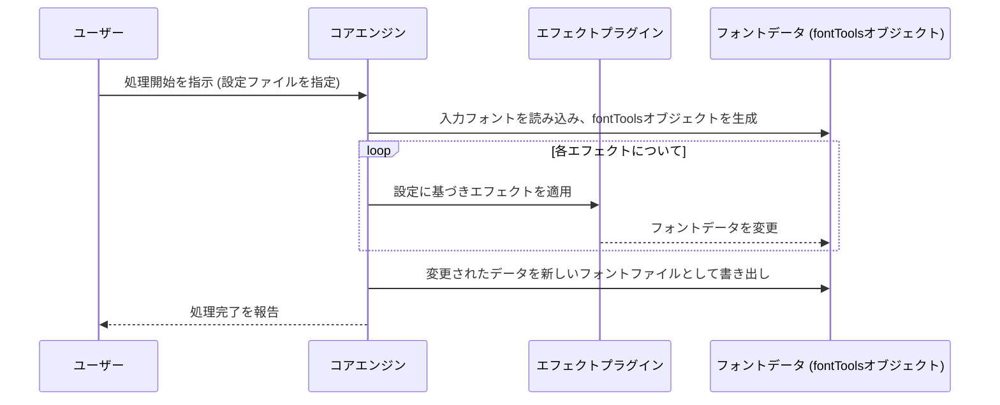

# フォントエフェクトシステム設計書

## 1. 概要

本システムは、OTF/TTFフォントファイルに対して、角丸処理や太らせる、輪郭線をつけるといった様々な視覚的エフェクトを適用するためのものです。拡張性の高いプラグインアーキテクチャを採用し、将来的に新しいエフェクトを容易に追加できることを目指します。

## 2. アーキテクチャ

システムの中心となる**コアエンジン**と、機能拡張のための**エフェクトプラグイン**で構成されます。ユーザーは**設定ファイル**（YAML形式）を通じて、適用したいエフェクトとその順序、パラメータを自由に定義できます。

```mermaid
graph TD
    subgraph User Interface
        A[設定ファイル (config.yaml)] --> B{コアエンジン};
    end

    subgraph System Core
        B -- 読み込み --> C[入力フォント (input.otf)];
        B -- 適用指示 --> D{エフェクトパイプライン};
        D -- 1. 実行 --> E1[角丸プラグイン];
        D -- 2. 実行 --> E2[太字化プラグイン];
        D -- 3. 実行 --> E3[...];
        B -- 書き出し --> F[出力フォント (output.otf)];
    end

    subgraph Plugins
        E1 -- 処理 --> G[(フォントデータ)];
        E2 -- 処理 --> G;
        E3 -- 処理 --> G;
    end

    C --> G;
    G --> F;
```

## 3. 主要コンポーネントの役割

### 3.1. コアエンジン (`FontProcessor`)

-   **役割**: システム全体の処理フローを管理する中核コンポーネント。
-   **機能**:
    -   `fontTools`ライブラリを使用してフォントファイルの読み込み・書き出しを行う。
    -   設定ファイル（`config.yaml`）を解析し、指定されたエフェクトを順に実行するパイプラインを構築・管理する。
    -   各エフェクトプラグインを動的にロードし、実行する。

### 3.2. エフェクトプラグイン (`effects/`)

-   **役割**: 個々のフォント変形処理を実装する独立したモジュール。
-   **構成**:
    -   「角丸」「太らせる」といった各エフェクトは、独立したPythonファイルとして`effects/`ディレクトリに格納される。
    -   全てのプラグインは、共通のインターフェース（抽象基底クラス `BaseEffect`）を継承する。
    -   `apply(font_data, **kwargs)`のような統一されたメソッドを実装し、コアエンジンからの呼び出しに応じる。

### 3.3. 設定ファイル (`config.yaml`)

-   **役割**: ユーザーが処理内容を定義するためのインターフェース。
-   **記述内容**:
    -   入力フォントと出力フォントのパス。
    -   適用するエフェクトのリスト。リストの順序が処理順となる。
    -   各エフェクトに渡すパラメータ（例: 角丸の半径、太らせる強度など）。

-   **記述例**:
    ```yaml
    input_font: "path/to/your/font.otf"
    output_font: "path/to/your/rounded_font.otf"
    effects:
      - name: round_corners  # effects/round_corners_effect.py に対応
        params:
          radius: 10
      - name: bold
        params:
          strength: 5
    ```

## 4. データフロー



## 5. 拡張方法

新しいエフェクト（例: `outline`）を追加する手順は以下の通りです。

1.  **プラグイン作成**: `effects/outline_effect.py` のようなファイルを作成します。
2.  **クラス定義**: ファイル内に、`BaseEffect`を継承した`OutlineEffect`クラスを定義します。
3.  **処理実装**: `apply`メソッド内に、フォントのグリフデータに輪郭線を追加する処理を実装します。
4.  **設定ファイル更新**: ユーザーは`config.yaml`の`effects`リストに`outline`を追加するだけで、この新機能を利用できます。

これにより、コアエンジンのコードを変更することなく、システムの機能を拡張できます。

## 6. 使用技術

-   **言語**: Python 3.x
-   **主要ライブラリ**:
    -   `fontTools`: フォントファイルの読み込み、操作、書き出し。
    -   `PyYAML`: 設定ファイルの解析。